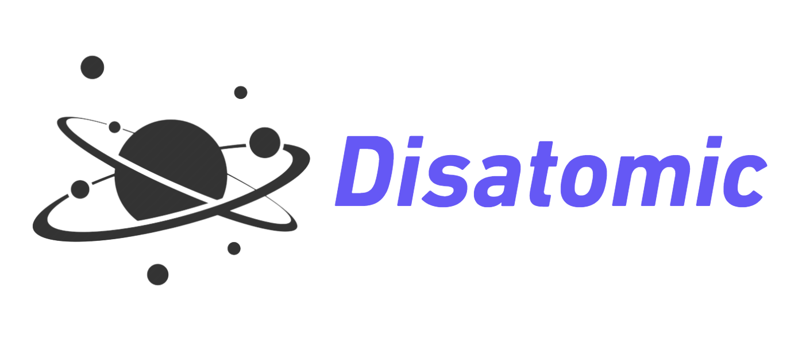

**
A minimal online chat service, and provided both website and cross-platform desktop application with <a href="https://www.electronjs.org/">Electron</a>.
**

## Disatomic

- [Website](https://dis4tomic.com)
- [Back-End Repo](https://github.com/HackHow/Disatomic-Server)

## Tech Stack

## Acknowledgements

 - [Discord_UI_Clone](https://github.com/FabioJunik/Discord_UI_Clone)

## Contact
If you have some suggestions or feedback, please get in touch with me.

